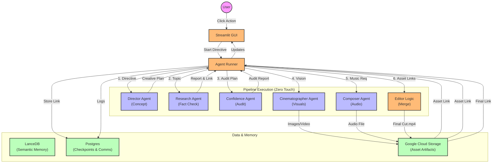

# System Architecture

```mermaid
graph TD
    classDef user fill:#f9f,stroke:#333,stroke-width:2px;
    classDef agent fill:#bbf,stroke:#333,stroke-width:2px;
    classDef tool fill:#fb7,stroke:#333,stroke-width:2px;
    classDef storage fill:#bfb,stroke:#333,stroke-width:2px;

    User((User)):::user
    App[Streamlit GUI]:::tool
    Runner[Agent Runner]:::tool
    
    subgraph "Pipeline Execution (Zero Touch)"
        Director["Director Agent <br/> (Concept)"]:::agent
        Research["Research Agent <br/> (Fact Check)"]:::agent
        Confidence["Confidence Agent <br/> (Audit)"]:::agent
        Cinema["Cinematographer Agent <br/> (Visuals)"]:::agent
        Composer["Composer Agent <br/> (Audio)"]:::agent
        Editor["Editor Logic <br/> (Merge)"]:::tool
    end
    
    subgraph "Data & Memory"
        LanceDB["LanceDB <br/> (Semantic Memory)"]:::storage
        Postgres["Postgres <br/> (Checkpoints & Comms)"]:::storage
        GCS["Google Cloud Storage <br/> (Asset Artifacts)"]:::storage
    end

    User -->|Click Action| App
    App -->|Start Directive| Runner
    
    Runner -->|1. Directive| Director
    Director -->|Creative Plan| Runner
    
    Runner -->|2. Topic| Research
    Research -->|Report & Link| Runner
    Runner -->|Store Link| Postgres
    
    Runner -->|3. Audit Plan| Confidence
    Confidence -->|Audit Report| Runner
    
    Runner -->|4. Vision| Cinema
    Cinema -->|Images/Video| GCS
    GCS -->|Asset Link| Runner
    
    Runner -->|5. Music Req| Composer
    Composer -->|Audio File| GCS
    GCS -->|Asset Link| Runner
    
    Runner -->|6. Asset Links| Editor
    Editor -->|Final Cut.mp4| GCS
    GCS -->|Final Link| Runner
    
    Runner -->|Updates| App
    Runner -->|Logs| Postgres
```
